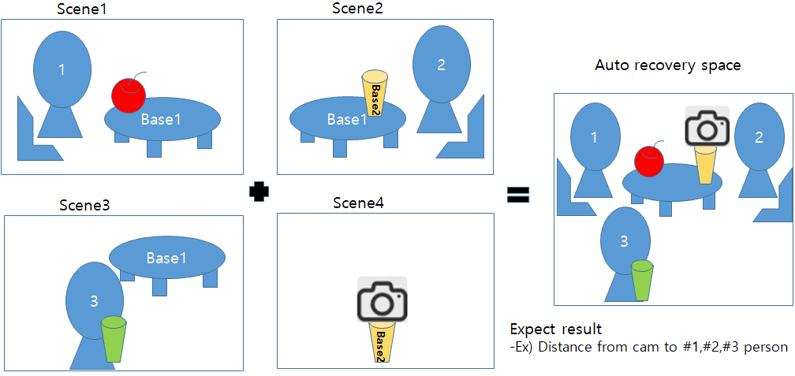
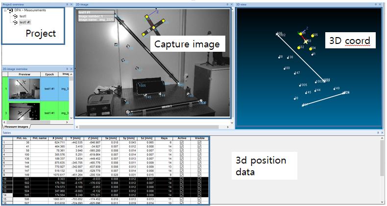
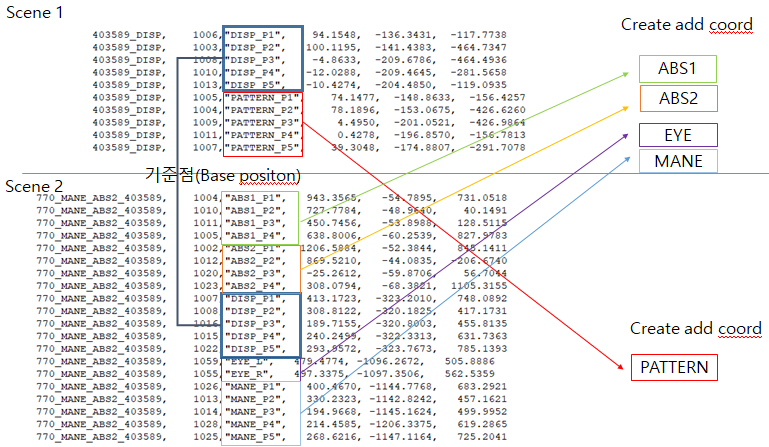
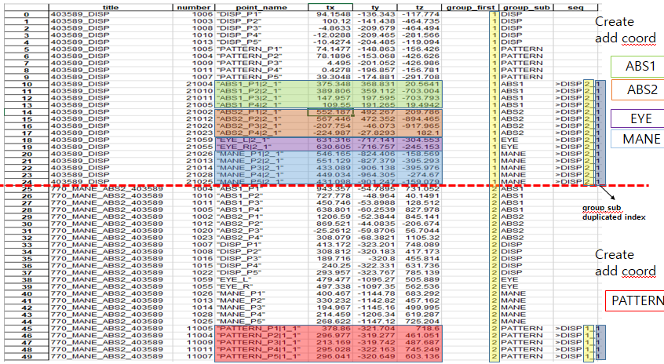
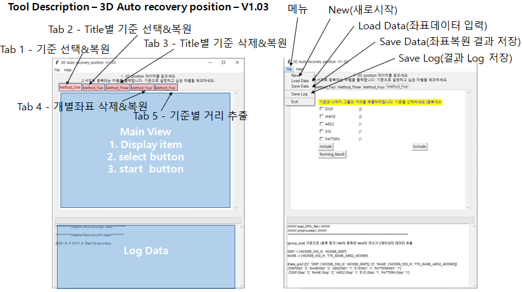
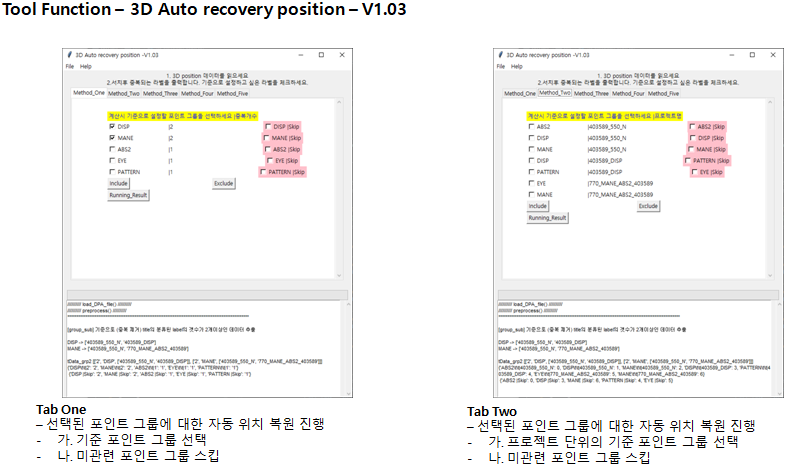
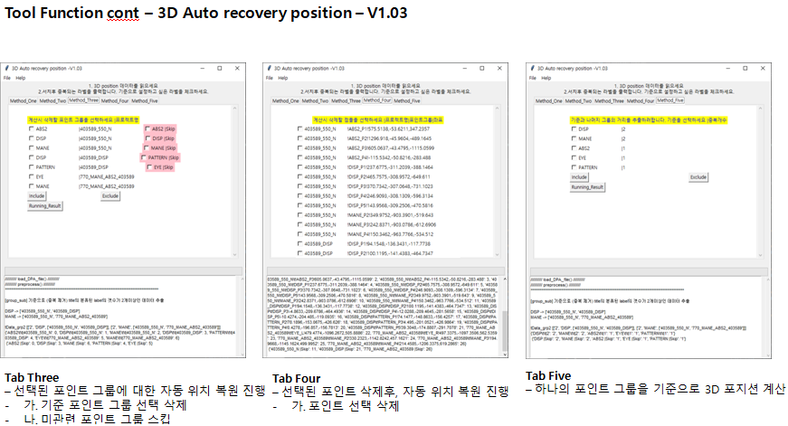
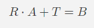
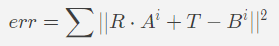
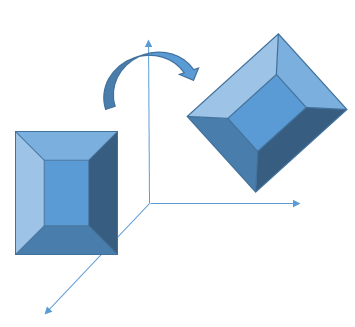

# 동일 3D공간상의 rigid변환을 이용한 자동 위치 복원(Automatic position recovery using rigid transform on  same 3D space)

2020년도 초반에 차량안의 DSM(Driver status monitoring)개발하고 있는 제품의 Head position accuracy를 검증하는 장비를 개발하였다. DSM 제품은 이 차량안에 사람의 얼굴을 모니터링하여, 졸음운전을 하는지, 전방을 주시하지 않는지 등의 알림을 주는 기능이다. 
검증 장비를 개발시에 디지털 카메라를 사용한 3D 측정장비([AICON의 DPA](https://www.hexagonmi.com/products/photogrammetry/moveinspect-technology/aicon-moveinspect-dpa))를 이용하여, 3차원 모델의 위치를 추출할 수 있었다. 주로 제품의 위치와 마네킹의 위치에 대한 Ground Truth를 추출하기 위해, rigid transform을 사용하였다.
하지만 이 GT를 생성하는 과정에서 12가지 얼굴의 위치와 여러 제품들의 위치, DPA장비로 누락되는 마커와 장비 내부 변경으로 인한 마커 손상으로 인해, 많은 시간과 휴먼 계산 오류 등으로 정확도가 감소할 가능성이 존재하였다.
이에 이 문제를 해결하기 위해, 단편적인 데이터를 재사용하고, 휴먼 계산 오류를 막기위해, rigid변환을 이용한 자동위치 복원 기능을 구현해 보았다. 

## 목적
1. 여러 장면으로 이루어진 물체의 위치를 통합시켜 자동 생성하는 툴인 GT(Ground Truth)를 만들고 얼굴위치 인식 알고리즘 검증에 사용하려는 목적
2. 자동화
3. 수학적 지식 불필요
4. 복잡한 계산 불필요
5. 계산시 오류 제거
6. 전처리&계산시간 단축

## 내용설명

여러 장면에 중복되는 기준이 되는 기준점이 존재한다고 가정한다.
기준점1(테이블), 기준점2(노란컵)
이 기준점들을 기반으로 하나의 3차원 공간을 만들수 있다.
(차집합들의 합) 
이들의 위치관계를 자동으로 복원시켜주는 기능을 이용하여
부분적으로 존재하는 카메라와 사람간의 거리 정보 좌표를 복원하여 3차원 GT(GroundTruth)를 구해볼 수 있음

## 필요 데이터
아래와 같은 데이터 입력이 필요함. 아래의 데이터를 통해 PATTERN 좌표와 EYE간의 3차원 공간을 만들고, 그 거리를 추출해낼수 있음

       403589_DISP,    1006,"DISP_P1",    94.1548,  -136.3431,  -117.7738
       403589_DISP,    1003,"DISP_P2",   100.1195,  -141.4383,  -464.7347
       403589_DISP,    1008,"DISP_P3",    -4.8633,  -209.6786,  -464.4936
       403589_DISP,    1010,"DISP_P4",   -12.0288,  -209.4645,  -281.5658
       403589_DISP,    1013,"DISP_P5",   -10.4274,  -204.4850,  -119.0935
       403589_DISP,    1005,"PATTERN_P1",    74.1477,  -148.8633,  -156.4257
       403589_DISP,    1004,"PATTERN_P2",    78.1896,  -153.0675,  -426.6260
       403589_DISP,    1009,"PATTERN_P3",     4.4950,  -201.0521,  -426.9864
       403589_DISP,    1011,"PATTERN_P4",     0.4278,  -196.8570,  -156.7813
       403589_DISP,    1007,"PATTERN_P5",    39.3048,  -174.8807,  -291.7078
       770_MANE_ABS2_403589,    1059,"EYE_L",   479.4774, -1096.2672,   505.8886
       770_MANE_ABS2_403589,    1055,"EYE_R",   497.3375, -1097.3506,   562.5359
       770_MANE_ABS2_403589,    1026,"MANE_P1",   400.4670, -1144.7768,   683.2921
       770_MANE_ABS2_403589,    1013,"MANE_P2",   330.2323, -1142.8242,   457.1621
       770_MANE_ABS2_403589,    1014,"MANE_P3",   194.9668, -1145.1624,   499.9952
       770_MANE_ABS2_403589,    1028,"MANE_P4",   214.4585, -1206.3375,   619.2865
       770_MANE_ABS2_403589,    1025,"MANE_P5",   268.6216, -1147.1164,   725.2041
       403589_550_N,    1009,"DISP_P1",   237.6775,  -311.2039,  -388.1464
       403589_550_N,    1017,"DISP_P2",   465.7575,  -308.9572,  -649.6110
       403589_550_N,    1019,"DISP_P3",   370.7342,  -307.0648,  -731.1023
       403589_550_N,    1023,"DISP_P4",   246.9093,  -308.1309,  -596.3134
       403589_550_N,    1025,"DISP_P5",   143.9568,  -309.2506,  -470.5816
       403589_550_N,    1022,"MANE_P2",   349.9752,  -903.3901,  -519.6430
       403589_550_N,    1015,"MANE_P3",   242.8371,  -903.0786,  -612.6906
       403589_550_N,    1014,"MANE_P4",   150.3462,  -963.7766,  -534.5120

위 데이터를 추출하기위해 우리는 AICON의 3D 측정장비([AICON의 DPA](https://www.hexagonmi.com/products/photogrammetry/moveinspect-technology/aicon-moveinspect-dpa)) 장비를 사용하였음

## 자동복원 Example 01
### input

### result

## 툴 사용법(Tool usage)

# Rigid Transform
 3차원 공간에서 동일한 크기의 물체가 이동했다고 가정하면, 그 물체의 전과 후의 이동과 회전값의 최적의 값을 찾을수 있다.
 만약 전, 후의 장면에서 물체를 구성하는 점들의 좌표가 누락된 경우도 동일한 방법으로 복원이 가능하지만, 점들이 전, 후 물체의 동일한 위치에  존재하는 점이 최소 3점 이상이여야 계산이 가능하다.
 계산은 매우 간단하다. 전과 후의 물체의 좌표 묶음을 행렬로 A,B로 표현하면 아래와 같은 식이 만들어지고, 여기서 A값에 R과 T를 계산하면 B의 값을 만들수 있는 R,T의 최적값을 찾아내는 방법이다.
 
$$R \cdot A + T = B $$ 
$$ err = \sum || R \cdot A^i + T - B^i ||^2  $$

위와 같이 계산을 하기위해서는 우선 A, B의 mean값을 구하여,모두 원점으로 이동시킨다. 그뒤에 A와 B의 각도 R값을 구하고(SVD사용), R을 구했기에 A와 내적을 구해, T를 찾아내는 방식으로 값을 구할수 있다.  

## 참고문헌
1. http://nghiaho.com/?page_id=671
2.  [https://en.wikipedia.org/wiki/Kabsch_algorithm](https://en.wikipedia.org/wiki/Kabsch_algorithm)
3.  “Least-Squares Fitting of Two 3-D Point Sets”, Arun, K. S. and Huang, T. S. and Blostein, S. D, IEEE Transactions on Pattern Analysis and Machine Intelligence, Volume 9 Issue 5, May 1987

